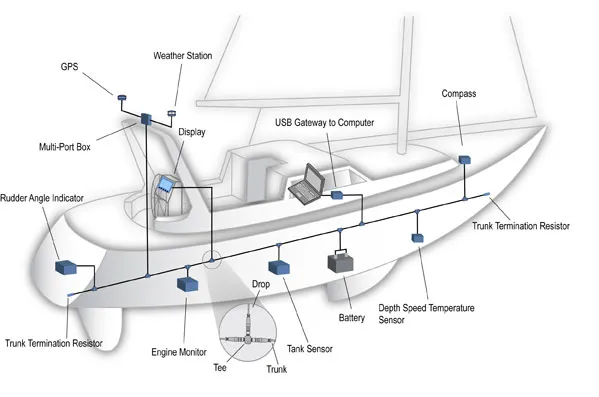

A simple script that interacts with the [NMEA Simulator](https://github.com/panaaj/nmeasimulator) via websocket. It gets the NMEA sentences and by a simple TTS make a corresponding voice message 

* NMEA 2000 --> BUS
* NMEA 0183 --> SERIAL

### Next steps 

- [ ] Integration with a Raspberry PI using the [PICAN-M - NMEA 0183 & NMEA 2000 HAT](https://copperhilltech.com/pican-m-nmea-0183-nmea-2000-hat-for-raspberry-pi/)
- [ ] Connection with [MFI glasses](https://www.myfutureinnovation.com/shop/prodotto/trendy-photochromic-blue-light/)

### Hardware 

- [ ] Raspberry PI
- [ ] SD card
- [ ] [PICAN-M - NMEA 0183 & NMEA 2000 HAT](https://copperhilltech.com/) or [PICAN-M - NMEA 0183 & NMEA 2000 HAT For Raspberry Pi With SMPS](https://copperhilltech.com/pican-m-nmea-0183-nmea-2000-hat-for-raspberry-pi-with-smps/) providing 12V on board power supply
- [ ] Enclosure
- [ ] Cables
- [ ] [MFI glasses](https://www.myfutureinnovation.com/shop/prodotto/trendy-photochromic-blue-light/)
- [ ] A NMEA 183 instrument (for testing)
- [ ] A NMEA 2000 instrument (for testing)
- [ ] NMEA cables and connectors
- [ ] Power supply

### Resources

* [Raspberry on a boat - Playlist](https://youtube.com/playlist?list=PLgYS2FpH2f4rLgdJ05F4KAOMvAgsLH1da)
* [How to Use NMEA-0183 With Raspberry Pi](https://www.instructables.com/How-to-Use-NMEA-0183-With-Raspberry-Pi/)
* [NMEA 2000 powered Raspberry Pi](https://seabits.com/nmea-2000-powered-raspberry-pi/)
* https://www.youtube.com/watch?v=11z81yPG_Mk

